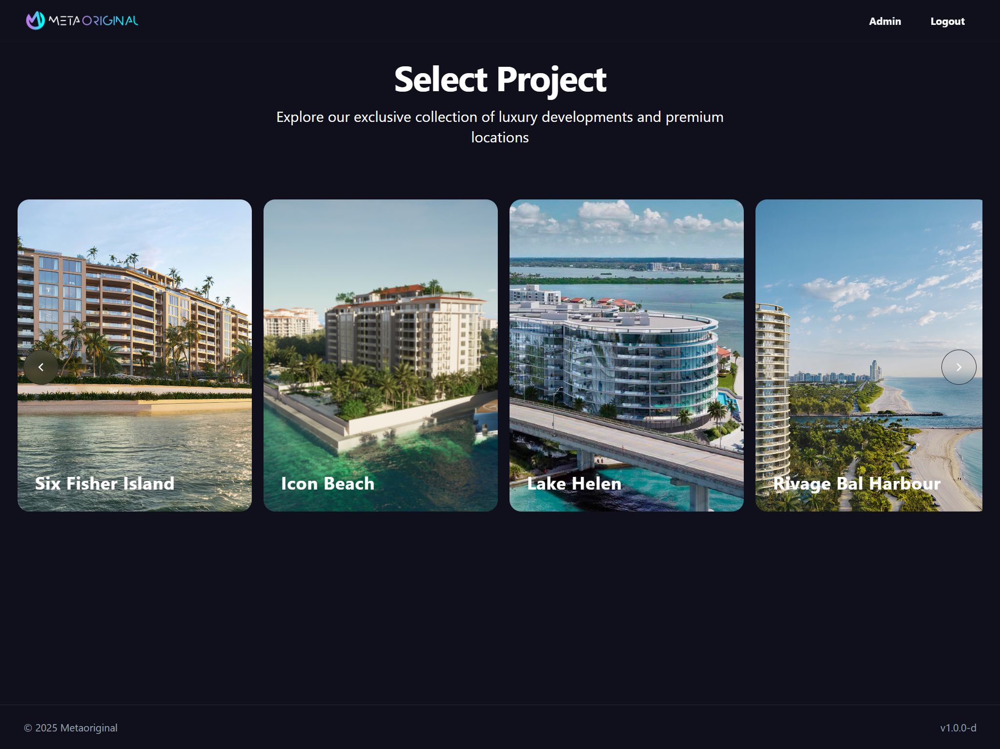
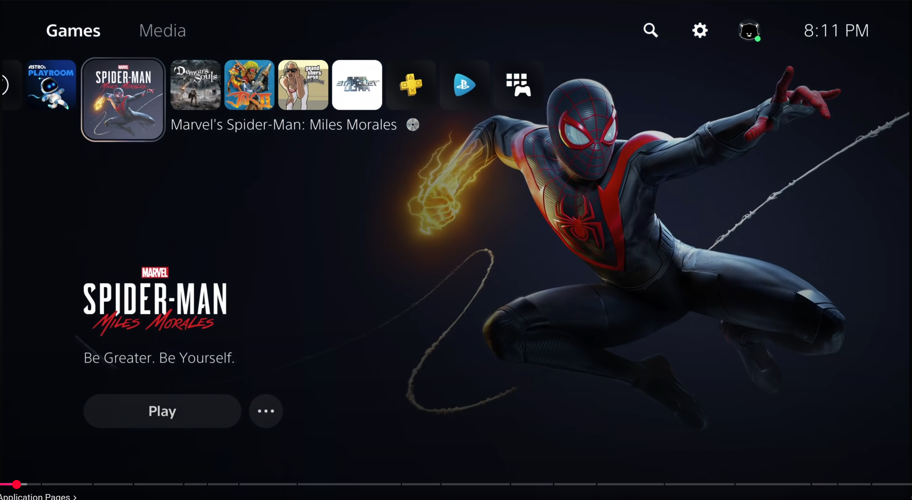

### **Teste Prático para Desenvolvedor(a) Front-end Pleno (Ruby on Rails)**

**Objetivo:**

Avaliar a capacidade do candidato de construir uma interface de usuário (UI) moderna, criativa e funcional utilizando Ruby on Rails (com ERB), HTML, CSS e JavaScript. O teste visa medir a habilidade em traduzir referências visuais em um produto final coeso, além de demonstrar boas práticas de desenvolvimento front-end em um ambiente Rails moderno.

**Contexto do Projeto Fictício:**

Estamos desenvolvendo uma nova plataforma de visualização de projetos de luxo chamada "Metaoriginal". Queremos criar uma tela de seleção de projetos que seja impactante e intuitiva para o usuário. A inspiração para a interface deve vir da navegação fluida e do design elegante do menu do PlayStation 5, enquanto a estrutura de conteúdo deve seguir o protótipo de seleção de projetos fornecido.

### 🖼️ Imagens de Referência

Abaixo estão as duas imagens principais para o desenvolvimento do teste.

---

#### 1. Protótipo da Aplicação (`Prototype.png`)
*Esta imagem define o conteúdo e a estrutura base da tela.*

---

#### 2. Inspiração de UI/UX (`References.png`)
*Esta imagem do menu do PlayStation 5 deve servir como inspiração para o design, layout e interatividade.*

[PS5 UI Reference Video](https://youtu.be/SFzjeVNOo68?si=uK2lk1pfy71VwX4C&t=320)

**Requisitos Técnicos:**

1.  **Stack Principal:**
    *   **Clonar o repositório** `git clone https://github.com/metaoriginal/metatest`
    *   **Backend:** Ruby on Rails (a lógica pode ser simples, o foco é o front-end).
    *   **Template Engine:** ERB (`.html.erb`).
    *   **CSS Framework:** O candidato pode escolher entre **Tailwind CSS** ou **Bootstrap 5**. O uso de um desses frameworks é obrigatório.
    *   **Gerenciamento de Assets:** O candidato pode escolher a ferramenta para o pipeline de assets. As opções incluem o padrão do Rails (Sprockets), uma abordagem moderna como `jsbundling-rails`/`cssbundling-rails`, ou o uso do **Vite.js** (através da gem `vite_ruby` ou configuração similar).

3.  **JavaScript e Interatividade:**
    *   O candidato é **livre para utilizar bibliotecas ou frameworks JavaScript** de sua preferência para aprimorar a interatividade da página.
    *   Sugestões incluem: **Stimulus.js** (padrão do Rails), A escolha deve ser justificada pela necessidade do projeto.

4.  **Funcionalidades e Estrutura:**
    *   Criar um controller Rails simples (`ProjectsController`, por exemplo) com uma action `index` que renderiza a página.
    *   Os dados dos projetos (título e imagem) devem vir do controller, simulando uma consulta a um banco de dados. Pode ser um array de hashes hardcoded no controller.
        *   Exemplo de dados: `[{title: 'Six Fisher Island', image_url: 'path/to/image1.jpg'}, ...]`
    *   A página deve renderizar dinamicamente a lista de projetos recebida do controller.

**Design e Interatividade (Inspirado no PS5):**

*   **Layout Principal:** Criar um layout que remeta à `References.png`. Um item (projeto) deve estar em foco/destaque, enquanto os outros aparecem de forma secundária, talvez em um carrossel horizontal.
*   **Item em Foco:** Quando um projeto é selecionado (seja por hover ou clique), a interface deve reagir. A imagem de fundo da página deve ser atualizada para a imagem do projeto em destaque, e seu título e outras informações devem ser exibidos de forma proeminente. O uso de JavaScript para gerenciar esse estado é esperado.
*   **Navegação Fluida:** A transição entre os projetos selecionados deve ser suave. O uso combinado de transições CSS e manipulação de eventos com JavaScript é fundamental para alcançar o "feeling" desejado.
*   **Criatividade:** O candidato tem liberdade para interpretar a referência do PS5. Elementos como ícones, tipografia, espaçamento e a experiência geral devem ser levados em conta. Não é necessário replicar exatamente, mas sim capturar a essência da experiência interativa.
*   **Responsividade:** A página deve ser, no mínimo, visualmente agradável em resoluções de desktop. A responsividade para dispositivos móveis é um grande diferencial.

**O que será avaliado:**

*   **Fidelidade à Inspiração:** Quão bem o candidato conseguiu capturar a estética e a experiência interativa do menu do PS5.
*   **Qualidade do Código:** Organização do código HTML (semântica), CSS, JavaScript e Ruby.
*   **Domínio do Framework CSS:** Uso eficiente e correto dos recursos do Tailwind CSS ou Bootstrap 5.
*   **Uso de JavaScript:** Escolha apropriada da ferramenta (biblioteca/framework) e implementação limpa da lógica de interatividade.
*   **Integração com Rails:** Habilidade de gerar HTML dinâmico com ERB e configurar/gerenciar assets (CSS e JS) dentro do ecossistema Rails, de acordo com a ferramenta escolhida.
*   **Atenção aos Detalhes:** Qualidade das animações, transições, espaçamentos e acabamento geral da interface.
*   **Criatividade e Resolução de Problemas:** Como o candidato interpretou as referências e superou os desafios para unir os dois conceitos.

**Entregáveis:**

*   O código-fonte do projeto Rails completo, hospedado em um repositório Git (GitHub, GitLab, etc.).
*   Um arquivo `README.md` com instruções claras sobre como configurar e rodar o projeto localmente, incluindo a justificativa da escolha da biblioteca JavaScript (se alguma for usada).
*   (Opcional) Um link para a aplicação rodando em uma plataforma de hospedagem gratuita (como Render) para facilitar a visualização.

**Prazo Sugerido:**

De 3 a 5 dias.
